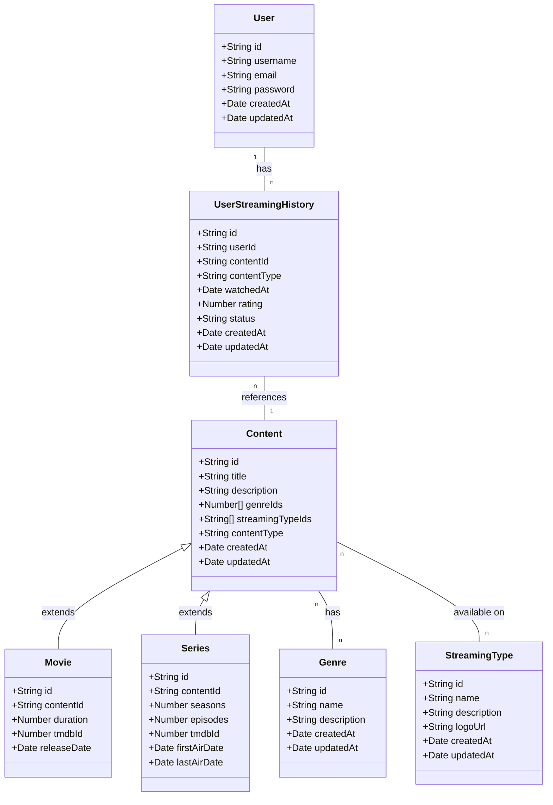
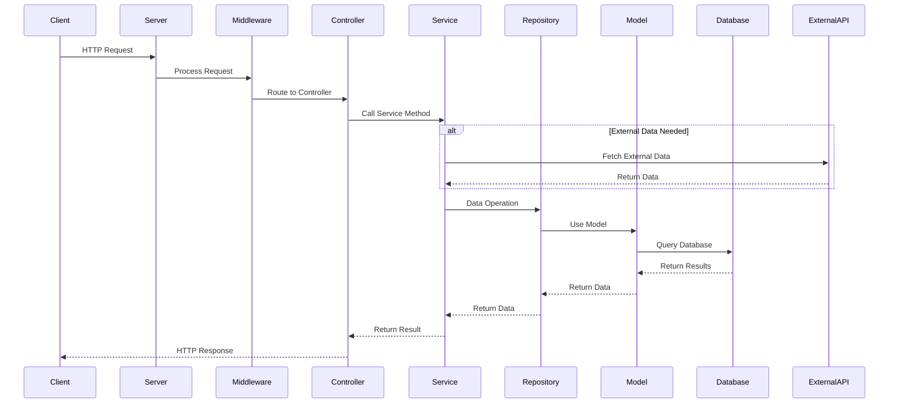

# Requisitos Não-Funcionais

Esta seção descreve como a arquitetura do sistema atende aos principais requisitos não-funcionais.

## Escalabilidade
- **Arquitetura em camadas**: Permite escalar componentes independentemente
- **MongoDB**: Suporta escalabilidade horizontal através de sharding
- **Padrão Repository**: Facilita a migração para uma arquitetura de microserviços no futuro
- **Docker**: Permite implantação em clusters como Kubernetes para escalabilidade

## Desempenho
- **Throttling**: Controla o uso de recursos para manter o desempenho sob carga
- **Índices no MongoDB**: Otimizados para consultas frequentes
- **Processamento assíncrono**: Utilizado para operações que não precisam de resposta imediata

## Segurança
- **Validação com Zod**: Previne injeção de dados maliciosos
- **Middleware de autenticação**: Controla acesso a recursos protegidos
- **Hashing de senhas**: Implementado com bcrypt
- **Sanitização de entradas**: Aplicada em todos os endpoints
- **Throttling**: Protege contra ataques de força bruta e DoS

## Manutenibilidade
- **TypeScript**: Fornece tipagem estática para detecção precoce de erros
- **Arquitetura em camadas**: Separa responsabilidades e facilita manutenção
- **Testes automatizados**: Garantem que mudanças não quebrem funcionalidades existentes
- **Documentação com Swagger**: Mantém a documentação da API atualizada
- **ADRs**: Documentam decisões arquiteturais para referência futura

## Disponibilidade
- **Tratamento de erros robusto**: Previne falhas catastróficas
- **Logging abrangente**: Facilita a identificação e resolução de problemas
- **Containerização**: Permite recuperação rápida em caso de falhas
- **Estratégia de fallback**: Implementada para lidar com indisponibilidade da API TMDB

## Usabilidade da API
- **Documentação com Swagger**: Facilita o entendimento e uso da API
- **Respostas de erro padronizadas**: Melhoram a experiência do desenvolvedor
- **Consistência nos endpoints**: Seguem padrões RESTful
- **Versionamento da API**: Permite evolução sem quebrar compatibilidade

# ADR - Architecture Decision Record
##  ADR 001: Escolha do MongoDB como Banco de Dados

### Contexto
O projeto precisa de um banco de dados flexível e escalável.

### Decisão
Utilizei MongoDB porque precisava de flexibilidade para armazenar dados sem um schema rígido. Pois de inicio não tinha modelos 100% finalizados e alguns conceitos e logicas ainda estavam sendo finalizados. Além disso, o Mongoose facilita a modelagem.

### Consequências
- Fácil adaptação a novas necessidades do projeto.
- Maior flexibilidade para armazenar diferentes formatos de dados.

## ADR 002: Arquitetura em Camadas

### Contexto
O projeto necessita de uma estrutura organizada, manutenível e escalável para gerenciar a complexidade do sistema de streaming.

### Decisão
Adotamos uma arquitetura em camadas com separação clara de responsabilidades:
- **Camada de API**: Rotas e Middlewares
- **Camada de Lógica de Negócios**: Controladores e Serviços
- **Camada de Acesso a Dados**: Repositórios e Modelos

### Consequências
- **Positivas**:
  - Separação clara de responsabilidades
  - Facilidade de manutenção e teste de cada componente isoladamente
  - Possibilidade de substituir implementações em uma camada sem afetar as outras
  - Melhor organização do código
- **Negativas**:
  - Maior complexidade inicial
  - Necessidade de mais arquivos e estruturas

## ADR 003: Uso do TypeScript

### Contexto
O desenvolvimento de uma API robusta requer segurança de tipos e melhor documentação do código.

### Decisão
Adotamos TypeScript como linguagem principal do projeto em vez de JavaScript puro.

### Consequências
- **Positivas**:
  - Detecção de erros em tempo de compilação
  - Melhor documentação através de tipos e interfaces
  - Melhor suporte de IDE com autocompletar e verificação de tipos
  - Facilita a manutenção e refatoração do código
- **Negativas**:
  - Curva de aprendizado para desenvolvedores não familiarizados com TypeScript
  - Necessidade de configuração adicional (tsconfig)
  - Processo de build adicional

## ADR 004: Padrão Repository

### Contexto
O acesso aos dados precisa ser abstraído para facilitar testes e possíveis mudanças no banco de dados.

### Decisão
Implementamos o padrão Repository para encapsular a lógica de acesso aos dados, separando-a da lógica de negócios.

### Consequências
- **Positivas**:
  - Abstração da fonte de dados
  - Facilidade para implementar testes unitários com mocks
  - Possibilidade de mudar a implementação do banco de dados sem afetar a lógica de negócios
  - Código mais limpo e organizado
- **Negativas**:
  - Camada adicional de abstração
  - Mais código para manter

## ADR 005: Integração com TMDB API

### Contexto
O sistema precisa de dados atualizados sobre filmes e séries, incluindo metadados como elenco, gêneros e avaliações.

### Decisão
Integramos com a API do TMDB (The Movie Database) para obter dados atualizados sobre filmes e séries.

### Consequências
- **Positivas**:
  - Acesso a uma base de dados rica e atualizada de conteúdo
  - Não precisamos manter nossa própria base de dados completa de filmes e séries
  - Informações atualizadas sobre lançamentos recentes
- **Negativas**:
  - Dependência de um serviço externo
  - Limitações de taxa de requisições
  - Necessidade de lidar com indisponibilidade temporária do serviço

## ADR 006: Uso do Zod para Validação

### Contexto
A validação de dados de entrada é crucial para garantir a integridade e segurança da API.

### Decisão
Adotamos a biblioteca Zod para validação de dados e definição de schemas.

### Consequências
- **Positivas**:
  - Validação de dados de entrada robusta e tipada
  - Inferência de tipos TypeScript a partir dos schemas
  - Código de validação declarativo e fácil de entender
  - Mensagens de erro claras e personalizáveis
- **Negativas**:
  - Dependência externa adicional
  - Curva de aprendizado para novos desenvolvedores

## ADR 007: Implementação de Throttling

### Contexto
A API precisa ser protegida contra uso excessivo e ataques de sobrecarga.

### Decisão
Implementamos um middleware de throttling para limitar o número de requisições por usuário em um determinado período. Por enquanto esse middleware está lidando so com requisições automáticas ao iniciar o servidor, futuramente será implementada a lógica que limite o número de requisições para qualquer usuário.

### Consequências
- **Positivas**:
  - Proteção contra ataques de sobrecarga
  - Uso mais justo dos recursos do servidor
  - Melhor experiência para todos os usuários
- **Negativas**:
  - Usuários legítimos podem ser limitados em casos de uso intensivo
  - Complexidade adicional no código
  - Necessidade de armazenar estado entre requisições

## ADR 008: Tratamento Centralizado de Erros

### Contexto
Uma API robusta precisa lidar com erros de forma consistente e fornecer respostas claras aos clientes.

### Decisão
Implementamos um middleware de tratamento de erros centralizado que captura exceções em toda a aplicação e formata respostas de erro padronizadas.

### Consequências
- **Positivas**:
  - Tratamento consistente de erros em toda a aplicação
  - Respostas de erro padronizadas para os clientes
  - Facilidade para adicionar logging e monitoramento de erros
  - Código mais limpo nas rotas e controladores, sem blocos try/catch repetitivos
- **Negativas**:
  - Possível perda de contexto específico em alguns erros
  - Necessidade de definir uma hierarquia de erros bem estruturada

## ADR 009: Documentação com Swagger

### Contexto
A API precisa ser bem documentada para facilitar seu uso por desenvolvedores internos e externos.

### Decisão
Adotamos Swagger/OpenAPI para documentação automática da API, com anotações nos endpoints.

### Consequências
- **Positivas**:
  - Documentação sempre atualizada e sincronizada com o código
  - Interface interativa para testar endpoints
  - Facilidade para gerar clientes em diversas linguagens
  - Melhora a experiência de desenvolvedores que consomem a API
- **Negativas**:
  - Overhead de manutenção das anotações de documentação
  - Possível exposição de informações sensíveis se não configurado corretamente

## ADR 010: Estrutura de Testes

### Contexto
O projeto precisa garantir qualidade e prevenir regressões através de testes automatizados.

### Decisão
Implementamos uma estratégia de testes com Jest, incluindo testes unitários, de integração e end-to-end, com diretórios __tests__ próximos ao código testado.

### Consequências
- **Positivas**:
  - Maior confiabilidade do código
  - Facilidade para refatorar com segurança
  - Documentação viva do comportamento esperado do sistema
  - Detecção precoce de problemas
- **Negativas**:
  - Tempo adicional de desenvolvimento para escrever e manter testes
  - Necessidade de configuração e manutenção da infraestrutura de testes
  - Possíveis falsos positivos em testes instáveis

## ADR 011: Containerização com Docker

### Contexto
O projeto precisa ser facilmente implantável em diferentes ambientes e garantir consistência entre desenvolvimento, teste e produção.

### Decisão
Adotamos Docker para containerizar a aplicação e suas dependências, com configurações específicas para desenvolvimento e produção.

### Consequências
- **Positivas**:
  - Ambiente de execução consistente em todas as fases do ciclo de vida
  - Facilidade de implantação em diferentes ambientes
  - Isolamento de dependências
  - Simplificação do processo de onboarding para novos desenvolvedores
- **Negativas**:
  - Curva de aprendizado para Docker
  - Overhead de recursos em comparação com implantação direta
  - Complexidade adicional na configuração de rede e volumes

## ADR 012: Sistema de Logging

### Contexto
Uma aplicação em produção precisa de um sistema robusto de logging para monitoramento, depuração e auditoria.

### Decisão
Implementamos um sistema de logging centralizado usando Winston, com diferentes níveis de log e formatos para desenvolvimento e produção.

### Consequências
- **Positivas**:
  - Visibilidade do comportamento da aplicação em produção
  - Facilidade para identificar e resolver problemas
  - Capacidade de auditoria para ações importantes
  - Flexibilidade para configurar diferentes destinos de log (console, arquivo, serviços externos)
- **Negativas**:
  - Impacto potencial no desempenho se o logging for excessivo
  - Necessidade de gerenciar rotação e retenção de logs
  - Risco de exposição de informações sensíveis nos logs

# Diagrams
## Diagram Project Architecture 

```mermaid
graph TD
    subgraph "API Layer"
        Server[Server.ts]
        Routes[Routes]
        Middleware[Middleware]
        Swagger[Swagger]
    end

    subgraph "Business Logic Layer"
        Controllers[Controllers]
        Services[Services]
        Validators[Validators]
    end

    subgraph "Data Access Layer"
        Repositories[Repositories]
        Models[Models]
        Interfaces[Interfaces]
    end

    subgraph "Database"
        MongoDB[(MongoDB)]
    end

    subgraph "External Services"
        TMDB[TMDB API]
    end

    %% Connections between components
    Server --> Routes
    Server --> Middleware
    Server --> Swagger
    
    Routes --> Controllers
    Controllers --> Services
    Services --> Repositories
    Services --> TMDB
    
    Repositories --> Models
    Models --> MongoDB
    
    Services --> Validators
    
    %% Detailed components
    Routes --> |"/movies"|MovieRoutes
    Routes --> |"/series"|SeriesRoutes
    Routes --> |"/user"|UserRoutes
    Routes --> |"/user-streaming-history"|UserStreamingHistoryRoutes
    Routes --> |"/streamingTypes"|StreamingTypeRoutes
    Routes --> |"/genre"|GenreRoutes
    Routes --> |"/commonMedia"|CommonMediaRoutes
    
    Controllers --> MovieController
    Controllers --> SeriesController
    Controllers --> UserController
    Controllers --> UserStreamingHistoryController
    Controllers --> StreamingTypeController
    Controllers --> GenreController
    Controllers --> CommonMediaController
    
    Services --> MovieService
    Services --> SeriesService
    Services --> UserService
    Services --> UserStreamingHistoryService
    Services --> StreamingTypeService
    Services --> GenreService
    Services --> TMDBService
    
    Repositories --> MovieRepository
    Repositories --> SeriesRepository
    Repositories --> UserRepository
    Repositories --> UserStreamingHistoryRepository
    Repositories --> StreamingTypeRepository
    Repositories --> GenreRepository
    Repositories --> ContentRepository
    
    Models --> MovieModel
    Models --> SeriesModel
    Models --> UserModel
    Models --> UserStreamingHistoryModel
    Models --> StreamingTypeModel
    Models --> GenreModel
    Models --> ContentModel
    
    Middleware --> ErrorHandler
    Middleware --> ThrottlingMiddleware
    
    %% Entity relationships
    UserModel --> UserStreamingHistoryModel
    MovieModel --> GenreModel
    SeriesModel --> GenreModel
    MovieModel --> StreamingTypeModel
    SeriesModel --> StreamingTypeModel
```

### Class Diagram

## Flow Diagram
